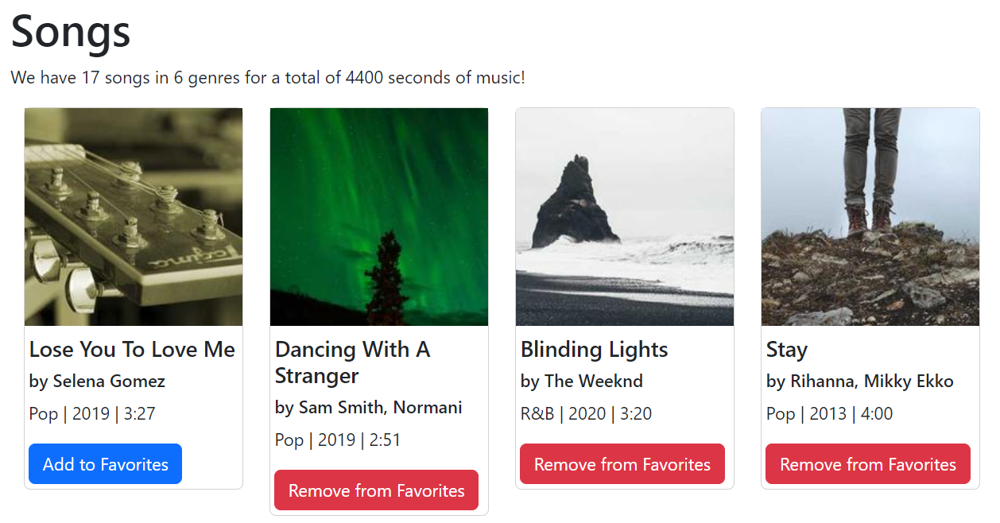
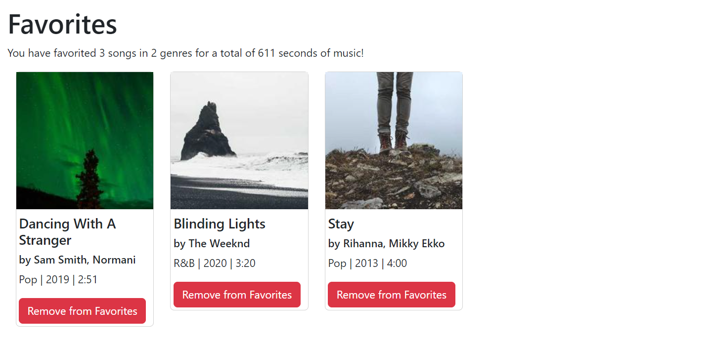

[](https://classroom.github.com/online_ide?assignment_repo_id=10231636&assignment_repo_type=AssignmentRepo)
# CS571-S23 HW05: Badger Beats

Welcome to Badger Beats -- Madison's largest up-and-coming music store! In this assignment, you will develop a *multi-page* application using [react-router](https://reactrouter.com/en/main) where users can favorite their top hits.

There are sections for both implementation *and* design. **Be sure to complete both!**

## Setup

The starter code provided to you was generated using [create-react-app](https://www.npmjs.com/package/create-react-app). Furthermore, [bootstrap](https://www.npmjs.com/package/bootstrap), [react-bootstrap](https://www.npmjs.com/package/react-bootstrap), and [react-router](https://reactrouter.com/en/main) have already been installed. **You should *not* re-run the create-react-app command**. Instead, in this directory, simply run...

```bash
npm install
npm start
```

Then, in a browser, open `localhost:3000`. You should *not* open index.html in a browser; React works differently than traditional web programming! When you save your changes, they appear in the browser automatically. I recommend using [Visual Studio Code](https://code.visualstudio.com/) to do your development work.

The components you will be working on are located in the `components` folder. There are several components here; these are just *suggestions*! You can create your React application however you would like.

## Tasks

### 1. Fetch and Display Song Data

On the "Songs" page of the website, display all of the songs from `https://cs571.org/s23/hw5/api/songs`. Be sure to display the song's name, author, genre, publishing year, length, and cover image. Also, include an appropriate `alt` tag for the cover image. Be sure to make your webpage responsive: display 1 column of cards on `xs` devices, 2 columns on `sm`, 3 columns on `md`, 4 columns on `lg`, and 6 columns on `xl`.


### 2. Display Summary Data

With this data, display a sentence above these cards stating...

```
We have XX songs in YY genres for a total of ZZ seconds of music!
```

... where `XX`, `YY`, and `ZZ` are calculated values. A genre is considered the same if the strings match exactly, e.g. "Pop" and "Pop" are the same genre, but "Pop" and "pop" are not. Furthermore, you can assume the length of a song will always be a string formatted like "3:21" or "0:59" or "12:35" or "78:22" where the minutes and seconds are split by a colon.

I would *encourage* but not *require* you to use declarative functions (specifically [reduce](https://developer.mozilla.org/en-US/docs/Web/JavaScript/Reference/Global_Objects/Array/reduce)) here. You may find [split](https://developer.mozilla.org/en-US/docs/Web/JavaScript/Reference/Global_Objects/String/split) and [parseInt](https://developer.mozilla.org/en-US/docs/Web/JavaScript/Reference/Global_Objects/parseInt) to be helpful as well.


### 3. Favoriting Songs

Add a button to each song that will allow the user to "favorite" the song. When a song is favorited, the button should change so that a user can un-favorite that same song. These favorited songs will then appear on the "Favorites" page implemented in Step 4.




### 4. Display Favorites

Display each of the songs that the user favorited on the "Favorites" page. In addition, display...

```
You have favorited XX songs in YY genres for a total of ZZ seconds of music!
```

... using the same logic as in Step 2 with the totals derived from **just** the favorited songs. When a user chooses to remove a favorite, the card should disappear from the favorites page and the total number of favorited songs, genres, and seconds should be updated.

How you choose to implement this sibling-to-sibling component communication is up to you! In the starter code, I have included some suggestion of using context. You may also choose to store data via `cookies`, `sessionStorage`, or `localStorage`, or you may consider using a third-party state management library like [redux](https://www.npmjs.com/package/redux) or [mobx](https://www.npmjs.com/package/mobx). Data only needs to be persisted between page switches -- if the user refreshes, it is okay for their favorites to be cleared.




That is it for Badger Beats! Now, consider and answer these design questions...

### Design Questions

The following questions ask about principles of interaction and visual design as they relate to Badger Beats. Please answer them by *modifying this README*, replacing "INSERT YOUR RESPONSE HERE" with your response. Thoughtful responses of 2-4 sentences grounded in content from the lectures should suffice.

1. Assume that Badger Beats contains thousands of songs. How would you load and display the results in an efficient manner?

An efficient way to do this will be to do paging. Load the results on different pages and allow navigation between these pages. This will allow efficient loading along with a neat display of songs.

2. Assume that Badger Beats contains thousands of songs. How would you help users narrow down their results?

There are quite a few ways to do this. A search bar would be a very convenient option for users to search for a song by title or artist. Another way could also be to implement a filter function so that the user can filter the songs by genre, artist, date, etc.

3. What are three aspects of visual design that *you used* in your implementation of Badger Beats?

Three aspects of visual design that were used in the implementation of Badger beats are Balance, Pattern, and Shape.

4. What are three aspects of visual design that *could be used* to improve your implementation of Badger Beats?

Three aspects of visual design that could be used to improve the implementation of Badger beats are Color, Harmony, and Variety.

### Done! 🥳

*Be sure to complete the design questions above!*

Congrats! Add, commit, and push your files to GitHub Classroom and paste your commit hash in the Canvas assignment.
# BadgerBeats

